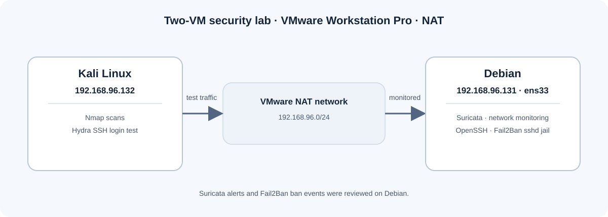

# Лабораторная работа: Suricata и Fail2Ban

[English version](README.md)

В этой практической лабораторной работе я использовал две виртуальные машины: Kali Linux для тестирования и Debian в качестве контролируемого сервера. На Debian я использовал Suricata для мониторинга сетевого трафика и наблюдал, как Fail2Ban заблокировал Kali после повторных неудачных попыток входа по SSH.

Все сканирования и проверки входа я проводил между собственными виртуальными машинами.

## Среда лабораторной работы



| Машина | Роль | IP-адрес |
| --- | --- | --- |
| Debian | Система мониторинга Suricata и SSH-сервер | `192.168.96.131` |
| Kali Linux | Машина для тестирования с Nmap и Hydra | `192.168.96.132` |

Я запускал обе виртуальные машины в VMware Workstation Pro с сетевыми адаптерами в режиме NAT. Сначала Debian не мог подключиться к сети в режиме Host-only. Я переключил адаптеры на NAT, после чего подключение заработало. На моём скриншоте Kali виден успешный ping до `8.8.8.8`: получены ответы на все три пакета, потерь нет.

Образы Linux я скачал с официальных сайтов.

## Цели

- Установить Suricata и Fail2Ban на Debian.
- Настроить Suricata для прослушивания сетевого интерфейса Debian `ens33`.
- Посмотреть оповещения Suricata во время сканирований Nmap с Kali.
- Проверить вход по SSH с Kali и посмотреть, как Fail2Ban блокирует адрес источника.

## Настройка Debian

Я обновил сведения о пакетах и установил инструменты мониторинга и блокировки:

```bash
apt update
apt install suricata fail2ban -y
systemctl status suricata
systemctl status fail2ban
```

Сетевой интерфейс я проверил командой:

```bash
ip a
```

Активный интерфейс Debian — `ens33`. В файле `/etc/suricata/suricata.yaml` я изменил интерфейс в разделе `af-packet`: вместо примера `eth0` указал `ens33`.

```yaml
af-packet:
  - interface: ens33
```

На моих скриншотах видно, что Debian использовал `ens33` с адресом `192.168.96.131/24`. Также на них показано, что Suricata 7.0.10 работала в системном режиме, а её служба была активна.

После изменения интерфейса я перезапустил Suricata. Во время настройки я также перезапустил сетевую службу и проверил подключение командой ping:

```bash
systemctl restart suricata
systemctl restart networking
ping -c 3 8.8.8.8
```

Затем я обновил правила Suricata и перезапустил службу:

```bash
sudo suricata-update
sudo systemctl restart suricata
```

Журнал оповещений я просматривал в реальном времени:

```bash
tail -f /var/log/suricata/fast.log
```

Сначала `tail -f` показывает последние строки, уже находящиеся в журнале, а затем ждёт и выводит новые строки по мере их появления. Поэтому сразу после запуска команды на экране могут быть более ранние события, а не события, вызванные самой командой `tail`. В сохранённом выводе часть строк датирована предыдущим днём. В журнале также есть события DHCP и обращения, связанные с управлением пакетами. Одно оповещение APT явно классифицировано как неподозрительный трафик.

## Сканирования Nmap с Kali

Пока на Debian был открыт журнал оповещений Suricata, я запустил с Kali следующие сканирования виртуальной машины Debian:

```bash
sudo nmap -sA 192.168.96.131
sudo nmap -sT 192.168.96.131
sudo nmap -sS 192.168.96.131
sudo nmap -sV 192.168.96.131
```

Эти параметры запускают ACK-сканирование (`-sA`), TCP Connect-сканирование (`-sT`), SYN-сканирование (`-sS`) и определение служб и их версий (`-sV`).

На скриншотах журналов Suricata виден трафик с `192.168.96.132` на `192.168.96.131`. Во время TCP Connect-сканирования (`-sT`) и SYN-сканирования (`-sS`) я увидел оповещения о MySQL (3306), Oracle (1521), Microsoft SQL Server (1433), PostgreSQL (5432), а также о возможном сканировании VNC (5800–5820). Во время определения служб и версий (`-sV`) я увидел оповещения о тех же портах баз данных и возможном сканировании VNC. Это оповещения правил Suricata о трафике сканирования, направленном на эти порты. Сами по себе они не подтверждают, что соответствующие службы были установлены или запущены на Debian.

Во время зафиксированного ACK-сканирования (`-sA`) в `fast.log` оповещений не появилось. ACK-сканирование отправляет TCP-пакеты с флагом ACK и обычно используется для исследования фильтрации пакетов; оно не определяет, открыты порты или закрыты. Отсутствие оповещений означает, что во время этого сканирования в журнал не записали подходящее оповещение. Это не доказывает, что Suricata не видела пакеты или сочла их безвредным сетевым шумом. Я не менял правила Suricata; возможно, использовавшиеся правила не сформировали оповещение для таких пакетов в условиях этого теста.

## Проверка SSH и Fail2Ban

Сначала я попробовал запустить Hydra до установки SSH-сервера:

```bash
sudo hydra -L user.txt -P pass.txt 192.168.96.131 ssh
```

Первая попытка не проверяла работу Fail2Ban, потому что на Debian ещё не было SSH-сервера. Обнаружив это, я установил OpenSSH-сервер, включил и запустил его службу:

```bash
apt install openssh-server -y
systemctl enable --now ssh
systemctl status ssh
```

На моих скриншотах видно, что служба SSH была включена и работала, прослушивая порт 22 по IPv4 (`0.0.0.0`)

На Kali я подготовил два текстовых файла: `user.txt` с пятью именами пользователей и `pass.txt` с пятью паролями. Их содержимое в проект не включено. После запуска SSH я повторил проверку с помощью Hydra:

```bash
hydra -L user.txt -P pass.txt 192.168.96.131 ssh
```

На Debian я просматривал журнал Fail2Ban в реальном времени:

```bash
tail -f /var/log/fail2ban.log
```

Я не менял конфигурацию Fail2Ban вручную. В Fail2Ban есть готовые фильтры, определения jail и действия блокировки. На моих скриншотах видно, что в этой установке Debian jail `sshd` был активен и использовал `systemd`-бэкенд. Точный файл, включивший этот jail, во время лабораторной я не проверял. В журнале указаны `maxRetry` — 5, `findtime` — 600 секунд и `bantime` — 600 секунд. Во время проверки Hydra Fail2Ban записал несколько строк `Found 192.168.96.132`, а затем — `Ban 192.168.96.132`. Это значения и события, которые я наблюдал; настройки я не редактировал.

После строки `Ban` на скриншоте видны дополнительные записи `Found`. Они показывают, что Fail2Ban продолжал находить в системном журнале SSH-записи, подходящие под фильтр. В сохранённом выводе Hydra указано, что запуск завершился с результатом `0 valid password found` — действительных паролей не найдено. Ошибки `Connection refused` на скриншоте нет.

## Результаты

- Я запустил Suricata на Debian и увидел оповещения о сканированиях с Kali.
- Fail2Ban обнаружил повторные неудачные попытки SSH-входа с Kali и заблокировал адрес `192.168.96.132`.
- В журнале указано установленное время блокировки (`bantime`) — 600 секунд (10 минут).

## Подтверждающие скриншоты

Скриншоты документируют настройку и наблюдавшиеся результаты. Нажми на имя файла, чтобы открыть изображение полностью.

| Этап | Скриншот |
| --- | --- |
| Настройка NAT в VMware | [vmware-nat.png](evidence/vmware-nat.png) |
| Адрес Kali и проверка подключения | [kali-ip-connectivity.png](evidence/kali-ip-connectivity.png) |
| Интерфейс и адрес Debian | [debian-interface.png](evidence/debian-interface.png) |
| Интерфейс Suricata в конфигурации | [suricata-interface-config.png](evidence/suricata-interface-config.png) |
| Статус Suricata | [suricata-service-status.png](evidence/suricata-service-status.png) |
| Ранее записанные события в журнале Suricata | [suricata-fast-log-existing-events.png](evidence/suricata-fast-log-existing-events.png) |
| Оповещения при TCP Connect-сканировании (`-sT`) | [nmap-tcp-connect-alerts.png](evidence/nmap-tcp-connect-alerts.png) |
| Оповещения при SYN-сканировании (`-sS`) | [nmap-syn-alerts.png](evidence/nmap-syn-alerts.png) |
| Оповещения при определении служб (`-sV`) | [nmap-service-detection-alerts.png](evidence/nmap-service-detection-alerts.png) |
| Статус службы Fail2Ban | [fail2ban-service-status.png](evidence/fail2ban-service-status.png) |
| Статус службы SSH | [ssh-service-status.png](evidence/ssh-service-status.png) |
| Jail `sshd` и показанные параметры | [fail2ban-sshd-jail.png](evidence/fail2ban-sshd-jail.png) |
| Событие блокировки Fail2Ban | [fail2ban-ban-event.png](evidence/fail2ban-ban-event.png) |
| Результат запуска Hydra | [hydra-test-result.png](evidence/hydra-test-result.png) |
| Более ранний снимок статуса Suricata и оповещений | [suricata-status-and-initial-alerts.png](evidence/suricata-status-and-initial-alerts.png) |
| Первая проверка журнала Fail2Ban | [fail2ban-initial-log-attempt.png](evidence/fail2ban-initial-log-attempt.png) |

## Примечания

- Описания оповещений и блокировки основаны на сделанных мной скриншотах терминала.
- Имена SSH-пользователей из списков, пароли и содержимое файлов со списками я не включал. На некоторых снимках терминала виден локальный пользователь `alex` в командной строке.
- На моих скриншотах показан журнал Suricata во время сканирований `-sT`, `-sS` и `-sV`. Во время `-sA` оповещений в `fast.log` не появилось. Данный результат является штатным и обусловлен конфигурацией Suricata по умолчанию.
- В этой лабораторной работе я практиковался в мониторинге и блокировке сетевой активности в учебной среде из двух виртуальных машин.

## Источники

- [Справочное руководство Nmap: методы сканирования портов](https://nmap.org/book/man-port-scanning-techniques.html)
- [Руководство пользователя Suricata](https://docs.suricata.io/)

