# EVE-NG on VMware Workstation: Cisco Image Setup

[Русская версия](README.ru.md)

Use this guide to start EVE-NG Community in VMware Workstation, transfer Cisco virtual device disks with WinSCP, and verify the nodes from their consoles.

> Cisco image binaries are proprietary and are not included in this repository. Use only images you are entitled to use.

## 1. Prepare the host computer

Install the following Windows applications:

- VMware Workstation Pro or Player to run the EVE-NG virtual machine.
- WinSCP to transfer files to the EVE-NG server.
- PuTTY to open an SSH session to the server.
- EVE-NG Windows Client Pack to connect browser-based device consoles to local terminal and capture applications. Download the client pack compatible with the installed EVE-NG version from the [official EVE-NG downloads page](https://www.eve-ng.net/index.php/download/).

The host CPU must support hardware virtualization, and virtualization must be enabled in firmware and passed through to the EVE-NG VM. EVE-NG documents VMware Workstation 16 or later and VT-x/EPT (or the corresponding supported AMD virtualization features) as requirements. [Supported systems](https://www.eve-ng.net/index.php/supported-hardware-and-software-systems/) · [VM installation guide](https://www.eve-ng.net/index.php/documentation/installation/virtual-machine-install/)

## 2. Install or open the EVE-NG virtual machine

1. Download the EVE-NG Community installation media from the [official download page](https://www.eve-ng.net/index.php/download/).
2. Follow the official VMware installation guide to create or import the EVE-NG VM. If EVE-NG is already installed, continue with the next step.
3. In VMware, check that the VM network adapter is connected and that nested hardware virtualization is enabled for the guest.
4. Start the VM and wait for the console to finish booting.
5. Note the management IP displayed in the console. Use that address for the browser, WinSCP, and PuTTY connections.

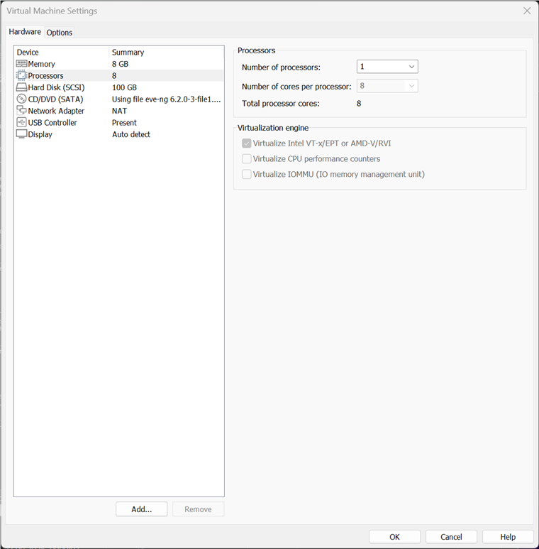
*VMware VM settings: NAT network adapter and Intel VT-x/EPT virtualization option.*

## 3. Install PuTTY and the EVE-NG Client Pack

1. Download PuTTY from its [official download page](https://www.chiark.greenend.org.uk/~sgtatham/putty/latest.html) and install the Windows package matching the host computer's architecture.
2. Download the Windows Client Pack for the installed EVE-NG version from the [official EVE-NG download page](https://www.eve-ng.net/index.php/download/) and install it. The official page lists Client Pack V3 as compatible with EVE-NG versions up to 6.x.
3. In the EVE-NG login page, select **Native console** when prompted. The client pack provides the local handlers that let the browser open device consoles in terminal applications.

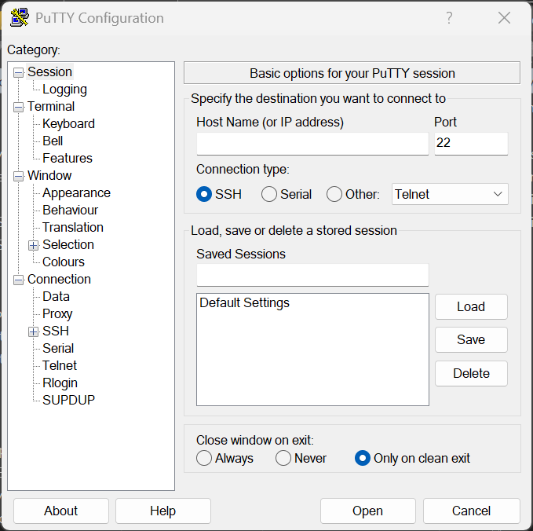
*PuTTY connection profile: select SSH and use port 22; enter the EVE-NG management IP when connecting.*

## 4. Transfer QEMU images with WinSCP

This guide uses QEMU-based images in QCOW2 format, not Cisco IOL `.bin` images. Create or use the corresponding image folders on the EVE-NG server. Name the disk inside each folder `virtioa.qcow2`.

1. Open WinSCP and create a new connection:
   - File protocol: **SFTP**
   - Host name: the management IP shown in the EVE-NG VM console
   - Port: `22`
   - User name and password: the authorized EVE-NG server credentials
2. Connect and open `/opt/unetlab/addons/qemu/` in the remote file panel.
3. Open the device's image folder and copy its licensed QCOW2 disk there, naming the disk `virtioa.qcow2`.
4. Use these image paths and folder names:

   ```text
   /opt/unetlab/addons/qemu/asav-9.5.3-9/virtioa.qcow2
   /opt/unetlab/addons/qemu/vios-router/virtioa.qcow2
   /opt/unetlab/addons/qemu/viosl2-switch/virtioa.qcow2
   ```

   EVE-NG requires the image folder prefix to match the device type: `asav-`, `vios-`, or `viosl2-`. Confirm the required disk filename in the [official naming table](https://www.eve-ng.net/index.php/documentation/qemu-image-namings/) for the exact image type. These three images use `virtioa.qcow2`.

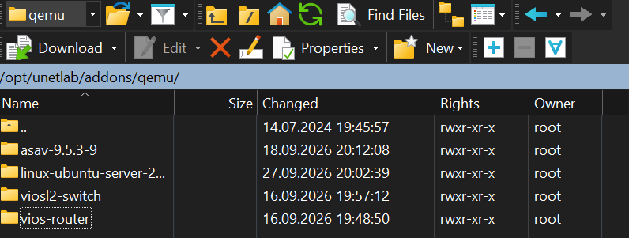
*Image directories on the EVE-NG server.*

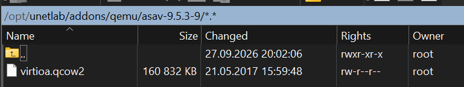
*ASAv image folder containing `virtioa.qcow2`.*

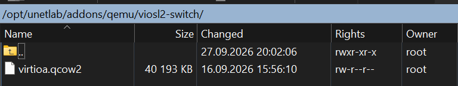
*vIOS L2 image folder containing `virtioa.qcow2`.*

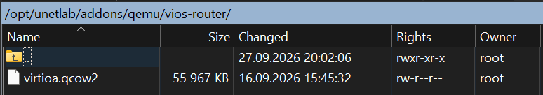
*vIOS router image folder containing `virtioa.qcow2`.*

## 5. Correct image permissions using PuTTY

1. Open PuTTY, enter the EVE-NG management IP, select SSH on port `22`, and choose **Open**.
2. At the first connection, verify and accept the server host key.
3. Sign in with the authorized server account.
4. Run EVE-NG's image permission repair command:

   ```bash
   /opt/unetlab/wrappers/unl_wrapper -a fixpermissions
   ```

This is the complete command; `fixpermissions` by itself is not the command to enter. The EVE-NG image guides use this wrapper after adding images. [Cisco vIOS image guide](https://www.eve-ng.net/index.php/documentation/howtos/howto-add-cisco-vios-from-virl/)

## 6. Create a lab and add nodes

1. Open a browser and navigate to `http://<EVE-NG-management-IP>/`.
2. Sign in to the EVE-NG web interface and select **Native console** if the console-type selector is shown.
3. Choose **Add new lab**, enter a lab name, and save it.
4. Open the lab. Right-click the topology canvas and choose **Node** (or use the add-node control).
5. Add the templates **Cisco ASAv**, **Cisco vIOS Router**, and **Cisco vIOS Switch**. Save each node with the required image selected.
6. Start the nodes. Wait for the boot process to finish.
7. Click a running node to open its console. With the EVE-NG Client Pack installed and **Native console** selected, the configured local terminal application should open.

The template selector shows the Cisco switch, router, and ASAv node types:

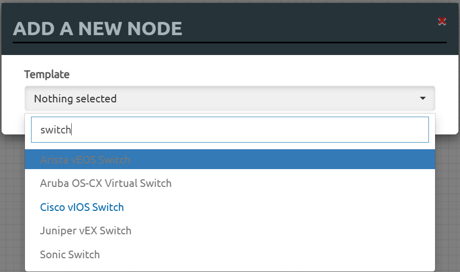
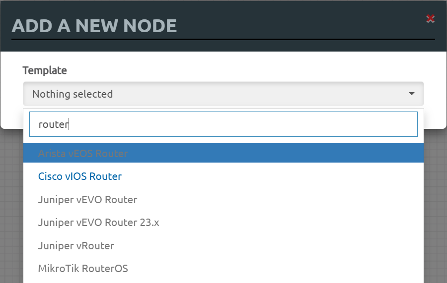
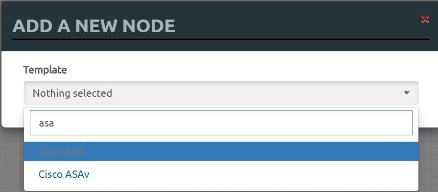

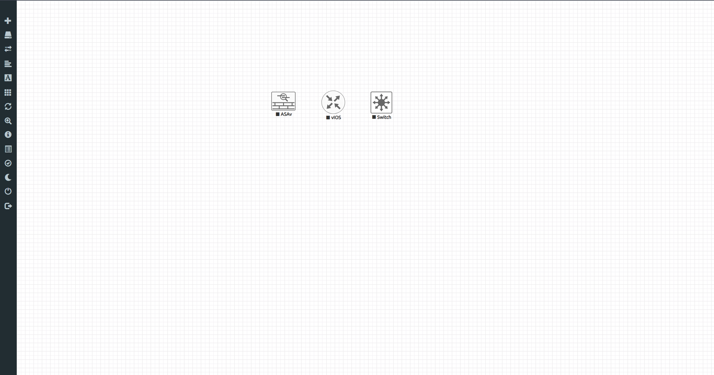
*Add the three nodes to the lab topology.*

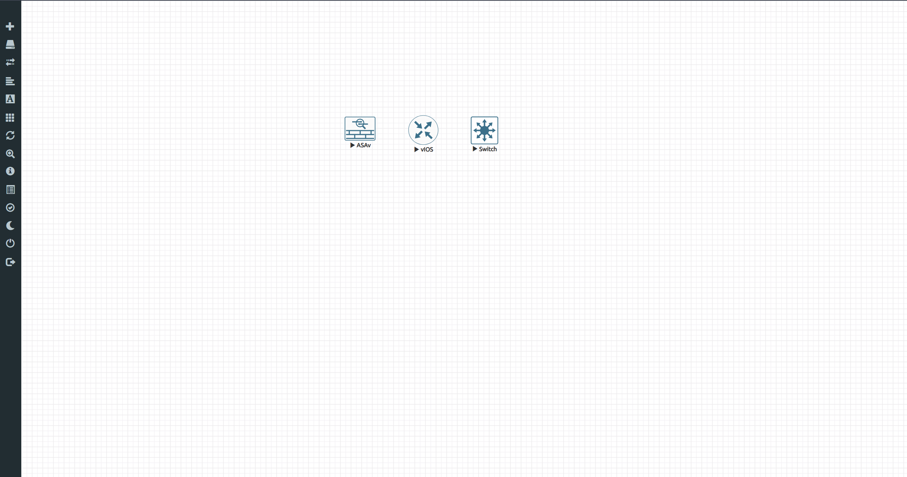
*The play icons indicate that the nodes are running.*

## 7. Verify the result

When the images start successfully, the device consoles display these command prompts:

| Device | Console prompt |
| --- | --- |
| Cisco ASAv | `ciscoasa>` |
| Cisco vIOS router | `Router>` |
| Cisco vIOS L2 switch | `Switch>` |

These prompts confirm that EVE-NG recognizes and boots the three images.

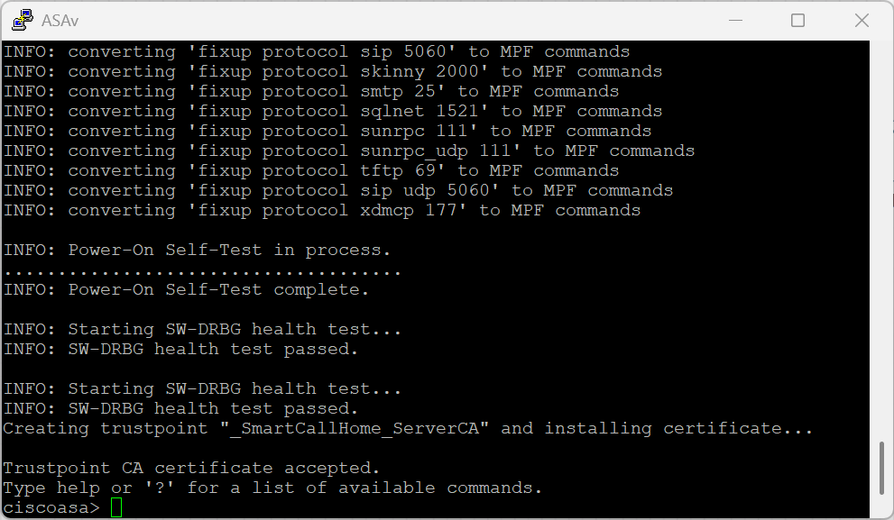
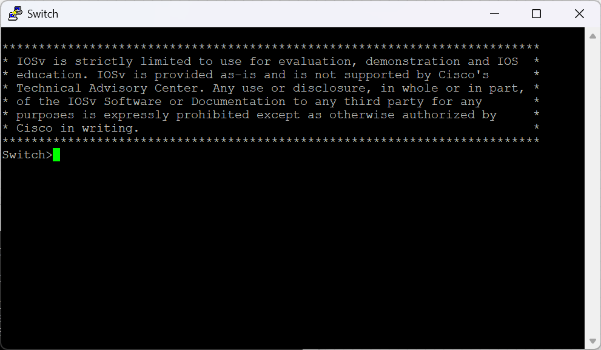
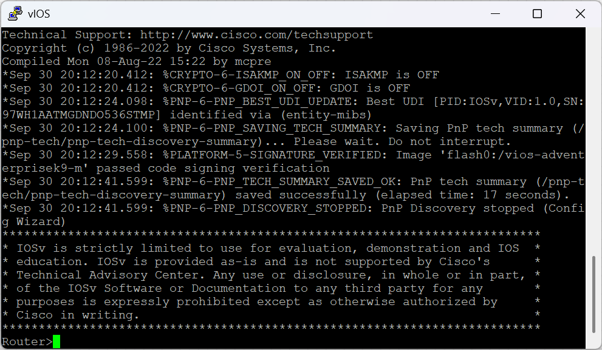

## Troubleshooting note: Cisco IOL images

Cisco IOL `.bin` images use EVE-NG's separate IOL image workflow and require a valid IOL license configuration. EVE-NG documents IOL and QEMU images in separate locations, and Cisco Community guidance identifies license setup as a troubleshooting step when an IOL node stops during startup. Image placement and permissions also need to be correct. I ran a license-related command while preparing the images, but the exact command and resulting license-file state are not recorded here, so the specific failure cannot be attributed to one cause. The host's Intel Core i7-13650HX model and 64-bit architecture do not, by themselves, establish that the processor caused the failure. I use the QCOW2 vIOS/ASAv images in this guide because they start successfully in this lab. ([EVE-NG Community Cookbook](https://www.eve-ng.net/wp-content/uploads/2024/04/EVE-CE-BOOK-6.0-2024.pdf) · [Cisco Community IOL startup troubleshooting](https://community.cisco.com/t5/cisco-software-discussions/when-i-start-iol-image-router-it-stops-within-few-seconds-on-eve/td-p/4310879))

## References

- [EVE-NG downloads, including the Windows Client Pack](https://www.eve-ng.net/index.php/download/)
- [EVE-NG virtual machine installation](https://www.eve-ng.net/index.php/documentation/installation/virtual-machine-install/)
- [EVE-NG supported hardware and software](https://www.eve-ng.net/index.php/supported-hardware-and-software-systems/)
- [EVE-NG QEMU image naming](https://www.eve-ng.net/index.php/documentation/qemu-image-namings/)
- [EVE-NG Cisco vIOS image guide](https://www.eve-ng.net/index.php/documentation/howtos/howto-add-cisco-vios-from-virl/)
- [PuTTY official downloads](https://www.chiark.greenend.org.uk/~sgtatham/putty/latest.html)
